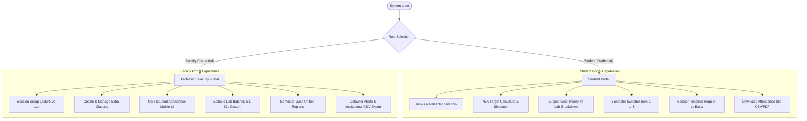

# Functional Specification & System Architecture Document
## Web-Based Student Attendance Management System
**Institution:** Government Engineering College, Bokaro (*राजकीय अभियंत्रण महाविद्यालय, बोकारो*)  
**Version:** 2.0 (Production Release)  
**Deployment Targets:** Render (Node.js/Express Backend), Vercel (React/Vite Frontend), Supabase (PostgreSQL Database)

---

## 1. Executive Summary & System Vision
The **GEC Bokaro Web-Based Student Attendance Management System** is a mobile-optimized, cloud-connected academic platform designed to streamline classroom attendance tracking for professors while providing students with real-time transparency regarding their attendance percentage and examination eligibility.

The system enforces the AICTE/State Technical University **75% minimum attendance rule** through an automated target calculator, separates theory lectures and practical lab batches, supports professor-conducted remedial and extra classes, and strictly isolates data across academic semesters.

---

## 2. User Roles & Permission Matrix



| Feature / Permission | Student Role | Professor / Faculty Role |
|---|:---:|:---:|
| Secure Portal Authentication | ✅ (Roll Number + PIN) | ✅ (Faculty ID + Password) |
| View Personal Attendance % | ✅ (Overall, Lecture, Lab) | ✅ (All Students) |
| 75% Target Deficit Calculator | ✅ (Real-time & Interactive) | ✅ (In Defaulter Reports) |
| Multi-Semester Historical View | ✅ (Semesters 1 – 8) | ✅ (Semesters 1 – 8) |
| Mark Regular Session Attendance | ❌ (Read Only) | ✅ (Full Roster Access) |
| Create & Conduct Extra Classes | ❌ | ✅ (With Remedial Objectives) |
| Customize / Rename Lab Batches | ❌ | ✅ (B1, B2, Custom) |
| Export Official Compliance Data | ✅ (Personal Slip) | ✅ (Class-wide Master CSV) |

---

## 3. Mathematical Model: 75% Attendance Target Safeguard

Let:
- $C$ = Total number of classes conducted to date in the semester (or for a given subject).
- $A$ = Number of classes attended by the student ($A \le C$).
- $P$ = Current attendance percentage:
  $$P = \begin{cases} 100\%, & \text{if } C = 0 \\ \left\lfloor \frac{A}{C} \times 100 \right\rfloor, & \text{if } C > 0 \end{cases}$$

### 3.1 Case 1: Attendance Shortage ($P < 75\%$)
When $P < 75\%$, the student is not eligible to appear for the semester end examinations. To find the minimum number of **consecutive upcoming classes ($X$)** the student must attend without missing any class:

$$\frac{A + X}{C + X} \ge 0.75$$

Multiplying both sides by $(C + X)$ (since $C + X > 0$):
$$A + X \ge 0.75C + 0.75X$$
$$X(1 - 0.75) \ge 0.75C - A$$
$$0.25X \ge 0.75C - A$$
$$X \ge \frac{0.75C - A}{0.25} = 3C - 4A$$

Thus, the exact number of consecutive classes required is:
$$X = \max\Big(0, \lceil 3C - 4A \rceil\Big)$$

> **Example:** A student has attended $A = 4$ out of $C = 10$ classes ($40\%$).  
> $$X = 3(10) - 4(4) = 30 - 16 = 14 \text{ classes}$$  
> If the student attends the next $14$ classes without absence:
> Total attended = $4 + 14 = 18$. Total conducted = $10 + 14 = 24$.
> New attendance = $\frac{18}{24} = 75.0\%$.

### 3.2 Case 2: Eligible ($P \ge 75\%$) — Safe Margin Buffer
When $P \ge 75\%$, the system computes the maximum number of upcoming classes ($M$) the student can afford to miss without dropping below $75\%$:

$$\frac{A}{C + M} \ge 0.75 \implies 0.75M \le A - 0.75C \implies M \le \frac{4A - 3C}{3}$$
$$M = \max\Big(0, \left\lfloor \frac{4A - 3C}{3} \right\rfloor\Big)$$

---

## 4. Functional Specifications: Student Portal

### 4.1 Student Login Page (`LoginPage.jsx`)
- **Access URL:** `/` or `/login`
- **Authentication Method:** Student University Roll Number (e.g. `2024CS002`, `2504001`) + optional password/PIN.
- **Verification Engine:** Matches `students` table records in Supabase (`roll_number ILIKE cleanRoll`).
- **Demo / Quick Access:** Instant 1-click test chips for enrolled students (e.g., *Aditi Verma (2024CS002)*, *Ananya Patel (2024CS003)*).
- **Session Persistence:** Securely stored in `localStorage` under `gec_attendance_auth`.

### 4.2 Student Dashboard (`StudentDashboard.jsx`)
1. **Institutional Profile Header:**
   - Displays student name, roll number, department (*Computer Science & Engineering*), semester, section, and assigned lab batch (*B1/B2/Custom*).
   - Prominently showcases the GEC Bokaro institutional badge.
2. **Semester Switcher:**
   - Dropdown supporting Semesters 1 through 8.
   - Dynamic real-time query reload for the selected semester without page refresh.
3. **Primary KPI Cards:**
   - **Theory Lectures:** Conducted vs. Attended with animated percentage progress bar.
   - **Practical Labs:** Filtered specifically by the student's assigned lab batch.
   - **Extra Classes Attended:** Highlights bonus remedial attendance gained.
4. **Interactive 75% Safeguard Widget:**
   - **Dynamic Color Alert:** Emerald Green (Safe $\ge 75\%$) vs. Rose Red / Amber (Critical Warning $< 75\%$).
   - **Explicit Target Directive:** Clearly displays *"Must Attend Next [X] Consecutive Classes to Reach 75%"* or *"Safe Margin: Can afford to miss up to [M] classes"*.
   - **Interactive Future Simulator Slider:** Students can slide $+0$ to $+20$ future classes attended to instantly project their resulting attendance percentage.
5. **Subject-Wise Breakdown Table:**
   - Tabular view listing Course Code, Course Title, Theory count, Lab count, Total conducted, Total attended, and individual subject eligibility status.
6. **Detailed Session History & Extra Class Timeline:**
   - Chronological log of sessions attended with Date, Time Slot, Location, Status (*Present / Absent / Late*).
   - Clear badge for sessions marked as `⚡ Extra Class` with the faculty's reason (*Syllabus Catch-up, Remedial, Exam Prep*).
7. **Official Report Download:**
   - One-click export to download an official attendance compliance CSV slip formatted with GEC Bokaro institutional headers.

---

## 5. Functional Specifications: Professor Portal

### 5.1 Faculty Login Page (`LoginPage.jsx`)
- **Access Credentials:** Faculty ID / Email (e.g., `faculty@gecbokaro.ac.in`) and Password (`admin123`).
- **Quick Demo Access:** One-click demo faculty login button for immediate evaluation.

### 5.2 Attendance Taking Session Setup (`SessionSelector.jsx` & `TakeAttendancePage.jsx`)
1. **Class Type Toggle:** Segmented switch between **Lecture Session** and **Practical Lab**.
2. **Extra / Remedial Class Toggle:**
   - Checkbox: *"Mark as Extra / Remedial Class"*.
   - Pre-configured reason selector:
     - *Syllabus Catch-up / Course Completion*
     - *Remedial / Revision Lecture*
     - *Lab Backlog Clearance*
     - *Special Exam Preparation & Numerical Practice*
     - *Doubt Clearing Session*
3. **Course Selector:** Populated from database with course code, name, credits, and semester.
4. **Class Cohort / Semester Filter:** Allows targeting specific student cohorts (Sem 1 to 8) with automatic fallback to full cohort so rosters are never empty.
5. **Lab Batch Division:** Select between `All Batches`, `Batch B1`, `Batch B2`, or create dynamic on-the-fly batches.

### 5.3 Attendance Marking Sheet (`AttendanceSheet.jsx`)
- One-tap status cycling: **Present (Green)** $\rightarrow$ **Absent (Red)** $\rightarrow$ **Late (Amber)**.
- Bulk quick actions: **Mark All Present**, **Mark All Absent**, **Clear**.
- Real-time attendance rate indicator.
- Search filter by student name or roll number.
- Direct save to Supabase with instantaneous feedback and transaction confirmation.

### 5.4 Unified Reports & Defaulter Analysis (`UnifiedReport.jsx`)
- Consolidated lecture + lab report per semester.
- Automatic filtering for **Attendance Defaulters ($< 75\%$)**.
- Exportable CSV report formatted with official GEC Bokaro headers.

### 5.5 Session History & Extra Classes Management (`HistoryPage.jsx`)
- Complete audit trail of past classes conducted.
- Filter pills: `All Sessions`, `Lectures Only`, `Labs Only`, `⚡ Extra Classes`.
- Session inspection modal showing full attendee roster and individual student remarks.
- Delete capability with confirmation prompt.

---

## 6. Database Schema Specification (PostgreSQL on Supabase)

### 6.1 `public.students`
```sql
CREATE TABLE IF NOT EXISTS public.students (
    id UUID PRIMARY KEY DEFAULT gen_random_uuid(),
    roll_number VARCHAR(30) UNIQUE NOT NULL,
    name VARCHAR(120) NOT NULL,
    email VARCHAR(120) UNIQUE,
    department VARCHAR(80) NOT NULL DEFAULT 'Computer Science & Engineering',
    semester INT NOT NULL DEFAULT 5,
    section VARCHAR(10) NOT NULL DEFAULT 'A',
    lab_batch VARCHAR(10) NOT NULL DEFAULT 'B1',
    phone VARCHAR(20),
    is_active BOOLEAN NOT NULL DEFAULT true,
    created_at TIMESTAMPTZ NOT NULL DEFAULT NOW(),
    updated_at TIMESTAMPTZ NOT NULL DEFAULT NOW()
);
```

### 6.2 `public.attendance_sessions`
```sql
CREATE TABLE IF NOT EXISTS public.attendance_sessions (
    id UUID PRIMARY KEY DEFAULT gen_random_uuid(),
    class_type VARCHAR(10) NOT NULL CHECK (class_type IN ('lecture', 'lab')),
    course_code VARCHAR(30) NOT NULL,
    course_name VARCHAR(150) NOT NULL,
    date DATE NOT NULL DEFAULT CURRENT_DATE,
    time_slot VARCHAR(50) NOT NULL,
    semester INT NOT NULL DEFAULT 5,
    section VARCHAR(10) NOT NULL DEFAULT 'A',
    lab_batch VARCHAR(10),
    professor_name VARCHAR(100) NOT NULL DEFAULT 'Dr. Robert Vance',
    topic_covered TEXT,
    location VARCHAR(50),
    is_extra_class BOOLEAN NOT NULL DEFAULT false,
    extra_reason VARCHAR(255),
    created_at TIMESTAMPTZ NOT NULL DEFAULT NOW()
);
```

### 6.3 `public.attendance_records`
```sql
CREATE TABLE IF NOT EXISTS public.attendance_records (
    id UUID PRIMARY KEY DEFAULT gen_random_uuid(),
    session_id UUID NOT NULL REFERENCES public.attendance_sessions(id) ON DELETE CASCADE,
    student_id UUID NOT NULL REFERENCES public.students(id) ON DELETE CASCADE,
    status VARCHAR(15) NOT NULL CHECK (status IN ('present', 'absent', 'late')),
    remarks VARCHAR(255),
    marked_at TIMESTAMPTZ NOT NULL DEFAULT NOW(),
    CONSTRAINT unique_session_student UNIQUE (session_id, student_id)
);
```

---

## 7. RESTful API Architecture

| Method | Endpoint | Description | Query / Body Parameters |
|---|---|---|---|
| `POST` | `/api/auth/student-login` | Authenticate student by roll number | `{ roll_number, password? }` |
| `POST` | `/api/auth/professor-login` | Authenticate faculty | `{ email_or_id, password }` |
| `GET` | `/api/reports/student/:id` | Student attendance & 75% target | `?semester=5` |
| `GET` | `/api/reports/unified` | Consolidated semester report | `?semester=5&month=all` |
| `POST` | `/api/sessions` | Create class session (Regular/Extra) | `{ class_type, course_code, is_extra_class, extra_reason, ... }` |
| `GET` | `/api/sessions` | List sessions with filters | `?class_type=all&is_extra_class=true&semester=5` |
| `POST` | `/api/attendance/submit` | Record bulk student attendance | `{ session_id, records: [...] }` |
| `GET` | `/api/students` | Get enrolled student roster | `?semester=5&lab_batch=B1` |

---

## 8. Deployment Architecture

```
                    ┌────────────────────────────────────────┐
                    │               CLIENT                   │
                    │   Mobile Phones & Desktop Browsers     │
                    └──────────────────┬─────────────────────┘
                                       │ HTTPS
                    ┌──────────────────▼─────────────────────┐
                    │         VERCEL (Frontend)              │
                    │   React 18 + Vite SPA                  │
                    │   Tailwind CSS + Lucide Icons          │
                    └──────────────────┬─────────────────────┘
                                       │ REST API (/api/*)
                    ┌──────────────────▼─────────────────────┐
                    │         RENDER (Backend)               │
                    │   Node.js (v20+) + Express             │
                    │   CORS + Error Handling Middleware     │
                    └──────────────────┬─────────────────────┘
                                       │ Supabase JS SDK (HTTPS)
                    ┌──────────────────▼─────────────────────┐
                    │        SUPABASE (Database)             │
                    │   Hosted PostgreSQL                    │
                    │   RLS Enabled + Indexed Queries        │
                    └────────────────────────────────────────┘
```
